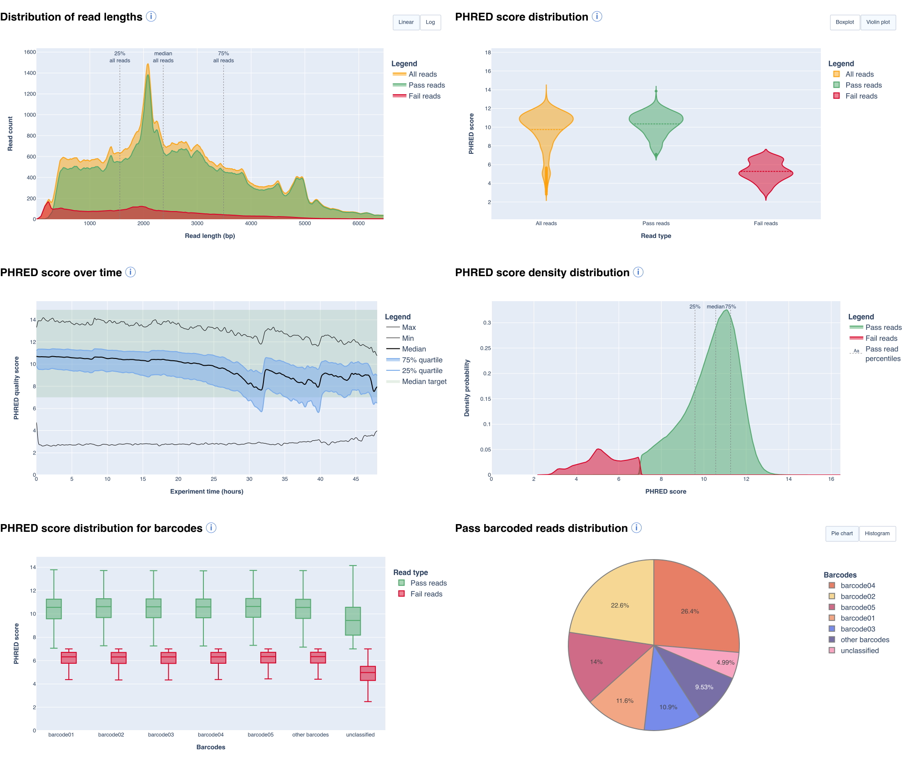

# A post sequencing QC tool for Oxford Nanopore sequencers 

  

ToulligQC is dedicated to the quality-control analysis of **Oxford Nanopore**
sequencing runs (MinION and others). It is written in Python and developed by
the [GenomiqueENS core facility](https://genomique.biologie.ens.fr/) of the
[Institute of Biology of the École Normale Supérieure (IBENS)](http://www.ibens.bio.ens.psl.eu/).

From a basecaller's output — a Guppy/Dorado `sequencing_summary.txt` (+ optional
`sequencing_telemetry.js`), or FASTQ/uBAM files — ToulligQC produces a single
self-contained **HTML report** with embedded Plotly graphs, plus a plain-text
`report.data` statistics file. It supports 1D² runs, barcoded runs and MinKNOW
samplesheets.

## Report preview

Click the image above for a live [example report](https://htmlpreview.github.io/?https://github.com/GenomiqueENS/toulligQC/blob/master/help/report.html).
An [online help](https://htmlpreview.github.io/?https://github.com/GenomiqueENS/toulligQC/blob/master/help/help.html)
explains each graph produced by ToulligQC — the same content shown when clicking
the ⓘ icons in a report.

## What you can do

- :material-rocket-launch: **[Getting started](getting_started.md)**

    Install ToulligQC with uv, pip, conda or Docker and run your first report.

- :material-console: **[Command line](tutorials/cli_usage.md)**

    Every option, input layout and example — plus what the report contains.

- :material-notebook: **[Python API](tutorials/api_usage.ipynb)**

    Run the pipeline in memory: statistics as DataFrames and inline Plotly figures.

- :material-code-braces: **[API reference](api/api.md)**

    The `TOULLIGQC` class and helpers, documented from the source.

## Highlights

- **Multiple inputs** — sequencing summary, FASTQ or uBAM, with optional
  telemetry, FAST5 or POD5 for run metadata.
- **Rich graphics** — read count and length distributions, yield over time,
  per-channel flow-cell heatmap, PHRED-score and length/quality densities, and
  length/speed/quality over sequencing time.
- **Barcoding & 1D²** — per-barcode quality, length and counts; native 1D²
  support; MinKNOW samplesheet aliases.
- **Two ways to run** — a command-line tool and an in-memory
  [Python API](tutorials/api_usage.ipynb).

## Support

Support is available on the
[GitHub issue page](https://github.com/GenomiqueENS/toulligQC/issues) and at genomique@bio.ens.psl.eu. See [Cite us](cite_us.md) for the list
of authors.
